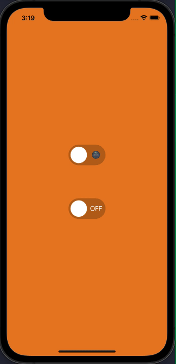
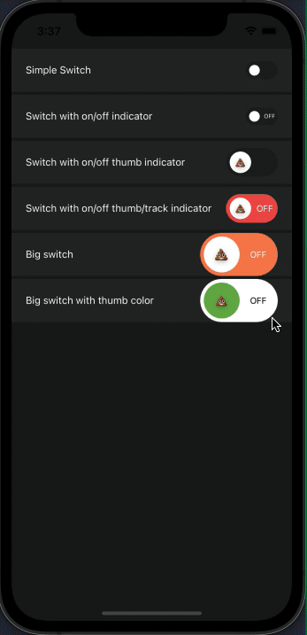

# React Native Switch Toggles 🔥

[](https://github.com/nithinpp69/react-native-switch-toggles/blob/main/LICENSE)

[](https://www.npmjs.com/package/react-native-switch-toggles)
[](https://www.npmjs.com/package/react-native-switch-toggles)

A simple and customizable React Native switch component. 

## Demo

## ❤️ [Try on Expo Snack](https://snack.expo.dev/@nithinpp69/react-native-switch-toggles)




## Prerequisites

 ⚠️ Peer Dependencies

 * [react-native-reanimated-v2](https://docs.swmansion.com/react-native-reanimated/docs/fundamentals/installation/)

This component has a peer dependency on react-native-reanimated-v2. react-native-reanimated-v2 has to be installed and linked into your project.
Follow [react-native-reanimated-v2](https://docs.swmansion.com/react-native-reanimated/docs/fundamentals/installation/) to install the dependency.

## Installation

 Supported version: react-native >= 0.59.0

  ```bash
  npm install react-native-switch-toggles
  ```
  
  or
  
  ```bash
  yarn add react-native-switch-toggles
  ```
  
## Example
```jsx
import Switch from 'react-native-switch-toggles';


const [isEnabled, setIsEnabled] = React.useState(false);
....

<Switch
  size={50}
  value={isEnabled}
  onChange={(value) => setIsEnabled(value)}
  renderOffIndicator={() => <Text style={{ fontSize: 16, color: 'white' }}>🌚</Text>}
  renderOnIndicator={() => <Text style={{ fontSize: 16, color: 'white' }}>🌝</Text>}
/>

<Switch
  size={50}
  value={isEnabled}
  onChange={(value) => setIsEnabled(value)}
  activeTrackColor={"#45D058"}
  renderOffIndicator={() => <Text style={{ fontSize: 16, color: 'white' }}>OFF</Text>}
  renderOnIndicator={() => <Text style={{ fontSize: 16, color: 'white' }}>ON</Text>}
/>

```


```jsx
import Switch from 'react-native-switch-toggles';


const [isEnabled, setIsEnabled] = React.useState(false);
....

<>
  <Text style={styles.label}>Simple Switch</Text>
  <Switch
    value={isEnabled}
    onChange={(value) => setIsEnabled(value)}
  />
</>


<>
  <Text style={styles.label}>Switch with on/off indicator</Text>
  <Switch
    value={isEnabled}
    onChange={(value) => setIsEnabled(value)}
    activeTrackColor={'#45D058'}
    renderOffIndicator={() => (
      <Text style={{ fontSize: 8, color: 'white' }}>OFF</Text>
    )}
    renderOnIndicator={() => (
      <Text style={{ fontSize: 8, color: 'white' }}>ON</Text>
    )}
  />
</>


<>
  <Text style={styles.label}>Switch with on/off thumb indicator</Text>
  <Switch
    size={40}
    value={isEnabled}
    onChange={(value) => setIsEnabled(value)}
    activeTrackColor={'#6ab04c'}
    renderInactiveThumbIcon={() => (
      <Text style={{ fontSize: 12, color: 'black' }}>💩</Text>
    )}
    renderActiveThumbIcon={() => (
      <Text style={{ fontSize: 12, color: 'black' }}>🔥</Text>
    )}
  />
</>


<>
  <Text style={styles.label}>
    Switch with on/off thumb/track indicator
  </Text>
  <Switch
    size={40}
    value={isEnabled}
    onChange={(value) => setIsEnabled(value)}
    activeTrackColor={'#6ab04c'}
    inactiveTrackColor={'#eb4d4b'}
    renderInactiveThumbIcon={() => (
      <Text style={{ fontSize: 12, color: 'black' }}>💩</Text>
    )}
    renderActiveThumbIcon={() => (
      <Text style={{ fontSize: 12, color: 'black' }}>🔥</Text>
    )}
    renderOffIndicator={() => (
      <Text style={{ fontSize: 12, color: 'white' }}>OFF</Text>
    )}
    renderOnIndicator={() => (
      <Text style={{ fontSize: 12, color: 'white' }}>ON</Text>
    )}
  />
</>


<>
  <Text style={styles.label}>Big switch</Text>
  <Switch
    size={60}
    value={isEnabled}
    onChange={(value) => setIsEnabled(value)}
    activeTrackColor={'#4b7bec'}
    inactiveTrackColor={'#ff7f50'}
    renderInactiveThumbIcon={() => (
      <Text style={{ fontSize: 16, color: 'black' }}>💩</Text>
    )}
    renderActiveThumbIcon={() => (
      <Text style={{ fontSize: 16, color: 'black' }}>🔥</Text>
    )}
    renderOffIndicator={() => (
      <Text style={{ fontSize: 12, color: 'white' }}>OFF</Text>
    )}
    renderOnIndicator={() => (
      <Text style={{ fontSize: 12, color: 'white' }}>ON</Text>
    )}
  />
</>


<>
  <Text style={styles.label}>Big switch with thumb color</Text>
  <Switch
    size={60}
    value={isEnabled}
    onChange={(value) => setIsEnabled(value)}
    activeThumbColor={'#f9ca24'}
    inactiveThumbColor={'#6ab04c'}
    activeTrackColor={'#6ab04c'}
    inactiveTrackColor={'#ffffff'}
    renderInactiveThumbIcon={() => (
      <Text style={{ fontSize: 14, color: 'black' }}>💩</Text>
    )}
    renderActiveThumbIcon={() => (
      <Text style={{ fontSize: 14, color: 'black' }}>🔥</Text>
    )}
    renderOffIndicator={() => (
      <Text style={{ fontSize: 12, color: 'black' }}>OFF</Text>
    )}
    renderOnIndicator={() => (
      <Text style={{ fontSize: 12, color: 'white' }}>ON</Text>
    )}
  />
</>

```


## Props
| Prop                        | Description                                                                           | Type                          | Default Value              | Required  |
| :--------------------------:|:--------------------------------------------------------------------------------------|:-----------------------------:|:--------------------------:|:---------:|
| value                       | switch on/off state value                                                             | Boolean                       |                            | true      |
| onChange                    | callback on switch value change                                                       | Function                      |  (value: boolean) => void; | true      |
| size                        | size of the switch component                                                          | Number                        |  25                        | false     |
| disabled                    | enable/disable switch                                                                 | Boolean                       |  false                     | false     |
| activeTrackColor            | track color when switch value is true                                                 | String                        |  "rgba(255,255,255,0.6)" | false     |
| inactiveTrackColor          | track color when switch value is false                                                | String                        |  "rgba(0,0,0,0.2)"       | false     |
| activeThumbColor            | thumb color when switch value is true                                                 | String                        |  "#ffffff"               | false     |
| inactiveThumbColor          | thumb color when switch value is false                                                | String                        |  "#ffffff"               | false     |
| renderOnIndicator           | render a custom view on switch track when the switch value is true                    | Function                      |  () => null                | false     |
| renderOffIndicator          | render a custom view on switch track when the switch value is false                   | Function                      |  () => null                | false     |
| renderActiveThumbIcon       | render a custom view on switch thumb when the switch value is true                    | Function                      |  () => null                | false     |
| renderInactiveThumbIcon     | render a custom view on switch thumb when the switch value is false                   | Function                      |  () => null                | false     |

## License
This project is licenced under the MIT License.
