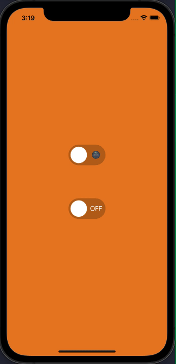

# react-native-switch-toggles

[]()

[](https://www.npmjs.com/package/react-native-switch-toggles)
[](https://www.npmjs.com/package/react-native-switch-toggles)

A simple and customizable React Native switch component. 

## Demo

❤️ [Expo Snack](https://snack.expo.dev/@nithinpp69/react-native-switch-toggles)



## Prerequisites

 ⚠️ Peer Dependencies

 * [react-native-reanimated-v2](https://docs.swmansion.com/react-native-reanimated/docs/fundamentals/installation/)

This component has a peer dependency on react-native-reanimated-v2. react-native-reanimated-v2 has to be installed and linked into your project.
Follow [react-native-reanimated-v2](https://docs.swmansion.com/react-native-reanimated/docs/fundamentals/installation/) to install the dependency.

## Installation

 Supported version: react-native >= 0.59.0

  ```
  npm install react-native-switch-toggles
  ```
  
  or
  
  ```
  yarn add react-native-switch-toggles
  ```
  
## Example
```
import Switch from 'react-native-switch-toggles';


const [isEnabled, setIsEnabled] = React.useState(false);
....

<Switch
  value={isEnabled}
  onChange={(value) => setIsEnabled(value)}
/>

```


## Props
| Prop                        | Description                                                                           | Type                          | Default Value              | Required |
| :--------------------------:|:--------------------------------------------------------------------------------------|:-----------------------------:|:--------------------------:|:--------:|
| value                       | switch state value                                                                    | Boolean                       |                            | true     |
| onChange                    | Callback on switch value change                                                       | Function                      |  (value: boolean) => void; | true     |

## License
This project is licenced under the MIT License.
